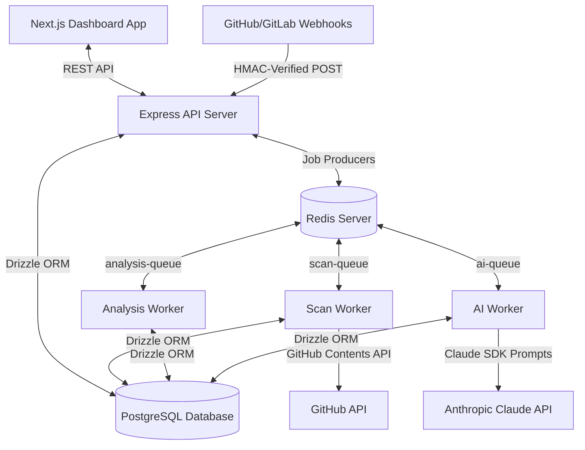

# CI/CD Reliability & Intelligence Platform — Complete Project Documentation

This document provides a comprehensive, detailed reference guide to the **CI/CD Reliability & Intelligence Platform**. It outlines the system architecture, file/directory structures, database schemas, core components, and step-by-step execution flows (especially the scan lifecycle). It also documents the specific issues encountered, their root causes, and how they were resolved.

---

## 1. System Architecture & High-Level Design

The platform uses a decoupled, event-driven, worker-based architecture to offload heavy CI/CD configuration parsing, security linting, and LLM-powered diagnostics from the main API gateway.



### Decoupled Worker Orchestration:
1. **Express API Server**: Serves as the gateway, handling user authentication, repository registration, webhooks, system monitoring metrics, and immediate scan requests.
2. **PostgreSQL & Drizzle ORM**: The single source of truth, persisting configurations, user information, historical scans, and AI diagnostics.
3. **Redis & BullMQ**: Implements distributed job queues with separate workers. This ensures that slow network operations (such as cloning repos) or slow API calls (such as generating LLM explanations) do not block the web app.
4. **Independent Workers**: 
   - **`ScanWorker`**: Fetches repository files and runs custom parsers.
   - **`AnalysisWorker`**: Evaluates files against a rules engine and calculates risk scores.
   - **`AIWorker`**: Calls Anthropic's Claude API to generate business explanations, predictions, and code patches.

---

## 2. Directory Map & Important Code Files

The project is structured as a monorepo containing the `backend` and `dashboard` codebases.

### 2.1 Backend Codebase (`/backend`)
* [backend/src/server.ts](file:///c:/work/ci-cd/cicd-prediction/backend/src/server.ts): The application entry point. Verifies database and Redis connection status before starting the HTTP server on port 3000.
* [backend/src/app.ts](file:///c:/work/ci-cd/cicd-prediction/backend/src/app.ts): Configures Express middlewares, establishes session handling, mounts routes under the `/api` and `/webhooks` scopes, and hooks in global error handling.
* [backend/src/db/schema.ts](file:///c:/work/ci-cd/cicd-prediction/backend/src/db/schema.ts): Houses the Drizzle ORM database schemas, enums, table constraints, and relations.
* [backend/src/lib/tokenCrypto.ts](file:///c:/work/ci-cd/cicd-prediction/backend/src/lib/tokenCrypto.ts): Crypto module providing secure AES-256-GCM encryption and HMAC-SHA256 signature verification for GitHub/GitLab access tokens before writing to/reading from the DB.
* [backend/src/routes/](file:///c:/work/ci-cd/cicd-prediction/backend/src/routes):
  - [repo.routes.ts](file:///c:/work/ci-cd/cicd-prediction/backend/src/routes/repo.routes.ts): Routes for registering, modifying, listing, and deleting repositories, including accessibility checks using access tokens.
  - [scan.routes.ts](file:///c:/work/ci-cd/cicd-prediction/backend/src/routes/scan.routes.ts): Defines manual scan execution, branch targets, and scan history retrieval.
  - [auth.routes.ts](file:///c:/work/ci-cd/cicd-prediction/backend/src/routes/auth.routes.ts): Manages user login, registration, and logout operations.
* [backend/src/parsers/](file:///c:/work/ci-cd/cicd-prediction/backend/src/parsers):
  - Contains custom parsers for converting CI/CD configurations into normalized JSON AST maps:
    - [github-actions.parser.ts](file:///c:/work/ci-cd/cicd-prediction/backend/src/parsers/github-actions.parser.ts) (YAML parsing, job extraction, step sequence)
    - [gitlab-ci.parser.ts](file:///c:/work/ci-cd/cicd-prediction/backend/src/parsers/gitlab-ci.parser.ts) (Stage pipelines, triggers)
    - [dockerfile.parser.ts](file:///c:/work/ci-cd/cicd-prediction/backend/src/parsers/dockerfile.parser.ts) (Instruction matching, base images)
    - [jenkinsfile.parser.ts](file:///c:/work/ci-cd/cicd-prediction/backend/src/parsers/jenkinsfile.parser.ts) (Stage detection)
    - [k8s-manifest.parser.ts](file:///c:/work/ci-cd/cicd-prediction/backend/src/parsers/k8s-manifest.parser.ts) (Kubernetes YAML resources)
* [backend/src/rules/](file:///c:/work/ci-cd/cicd-prediction/backend/src/rules):
  - [rule-registry.ts](file:///c:/work/ci-cd/cicd-prediction/backend/src/rules/rule-registry.ts): Catalog of 26 rules targeting security, reliability, performance, DAG, maintainability, and dependencies.
  - [rule-runner.ts](file:///c:/work/ci-cd/cicd-prediction/backend/src/rules/rule-runner.ts): Loops through normalized artifacts and matches rule configurations, creating individual violation records.
* [backend/src/workers/](file:///c:/work/ci-cd/cicd-prediction/backend/src/workers):
  - [scan.worker.ts](file:///c:/work/ci-cd/cicd-prediction/backend/src/workers/scan.worker.ts): Fetches repository files from GitHub/GitLab, executes parsers, and inserts parsed ASTs.
  - [analysis.worker.ts](file:///c:/work/ci-cd/cicd-prediction/backend/src/workers/analysis.worker.ts): Runs rules, writes findings, calculates risk scores, and schedules AI diagnostics.
  - [ai.worker.ts](file:///c:/work/ci-cd/cicd-prediction/backend/src/workers/ai.worker.ts): Queries Anthropic's Claude to generate detailed summaries, remediations, and predictions.

---

### 2.2 Frontend Dashboard Codebase (`/dashboard`)
* [dashboard/src/lib/api-client.ts](file:///c:/work/ci-cd/cicd-prediction/dashboard/src/lib/api-client.ts): Outlines API service calls, handling responses, payloads, and error mappings.
* [dashboard/src/components/repos/](file:///c:/work/ci-cd/cicd-prediction/dashboard/src/components/repos):
  - [repo-card.tsx](file:///c:/work/ci-cd/cicd-prediction/dashboard/src/components/repos/repo-card.tsx): Displays overall risk score, monitoring status, and provides the primary interactive "Scan Now" button.
  - [add-repo-modal.tsx](file:///c:/work/ci-cd/cicd-prediction/dashboard/src/components/repos/add-repo-modal.tsx): Popup form managing repository URL validation, provider selection, and token input.
* [dashboard/src/components/scans/](file:///c:/work/ci-cd/cicd-prediction/dashboard/src/components/scans):
  - [ai-report-panel.tsx](file:///c:/work/ci-cd/cicd-prediction/dashboard/src/components/scans/ai-report-panel.tsx): Side panel presenting Claude's explanations, side-by-side git diff corrections, and predictions.
  - [score-gauge.tsx](file:///c:/work/ci-cd/cicd-prediction/dashboard/src/components/scans/score-gauge.tsx): Circular visual progress indicator mapping numeric risk scores to letter grades.
* [dashboard/src/app/(dashboard)/repos/](file:///c:/work/ci-cd/cicd-prediction/dashboard/src/app/(dashboard)/repos):
  - [page.tsx](file:///c:/work/ci-cd/cicd-prediction/dashboard/src/app/(dashboard)/repos/page.tsx): Main dashboard view of registered repositories.
  - [[id]/scans/[scanId]/page.tsx](file:///c:/work/ci-cd/cicd-prediction/dashboard/src/app/(dashboard)/repos/[id]/scans/[scanId]/page.tsx): Comprehensive audit details page. Integrates code highlighting, findings logs, and the AI panel.

---

## 3. End-to-End Execution Flow of the "Scan" Feature

Here is exactly what happens behind the scenes when a user triggers a repository scan from the web dashboard:

```
[Web Dashboard] 
       │ 1. Clicks "Scan Now"
       ▼
[Express API Gateway (POST /api/repos/:id/scan)]
       │ 2. Authenticates, fetches User's encrypted token
       │ 3. Decrypts token using tokenCrypto.ts
       │ 4. Caches token in Redis (temp-token:<repoId>)
       │ 5. Creates "queued" Scan record in DB
       │ 6. Enqueues job in BullMQ scan-queue
       ▼
[ScanWorker (scan-queue)]
       │ 7. Retrieves cached token, fetches files from GitHub
       │ 8. Executes Parsers, extracts AST
       │ 9. Inserts AST to parsed_artifacts DB Table
       │ 10. Enqueues job in BullMQ analysis-queue
       ▼
[AnalysisWorker (analysis-queue)]
       │ 11. Runs 26 rules against AST
       │ 12. Writes findings, computes overall Risk Score
       │ 13. Writes report, enqueues job in BullMQ ai-queue (if score >= 40)
       ▼
[AIWorker (ai-queue)]
       │ 14. Constructs prompt, calls Anthropic Claude API
       │ 15. Formats and validates Explanations, Remediations, and Predictions
       │ 16. Writes results to DB, marks scan as "completed"
       ▼
[Web Dashboard]
       │ 17. Polling notices "completed" status, renders results
```

### Step 1: Frontend Dispatch
A user clicks the **Scan Now** button inside [repo-card.tsx](file:///c:/work/ci-cd/cicd-prediction/dashboard/src/components/repos/repo-card.tsx). The frontend calls `triggerScan(repoId)` from the [api-client.ts](file:///c:/work/ci-cd/cicd-prediction/dashboard/src/lib/api-client.ts), sending an HTTP request:
`POST http://localhost:3000/api/repos/:id/scan`

### Step 2: Ingestion & Authorization check (API Server)
The request hits [scan.routes.ts](file:///c:/work/ci-cd/cicd-prediction/backend/src/routes/scan.routes.ts):
- It fetches the target repository from the `repos` table.
- If the user is authenticated, it queries their record from the `users` table to fetch the `githubAccessToken`.
- It invokes `decryptTokenIfPresent(githubAccessToken)` from [tokenCrypto.ts](file:///c:/work/ci-cd/cicd-prediction/backend/src/lib/tokenCrypto.ts).
- Once decrypted, it stores the token in Redis with a 24-hour expiration (`temp-token:<repoId>`) so that the worker can securely access it.
- A new scan record is created in the database `scans` table with `status = 'queued'`.
- It enqueues a job on BullMQ's `scan-queue` and returns a `202 Accepted` response with the `jobId` and `scanId` back to the frontend.
- The frontend dashboard begins polling `/api/jobs/:jobId/status` to show a progress bar.

### Step 3: Cloning & Parsing (`ScanWorker`)
The worker picks up the job:
- It fetches the decrypted authentication token from Redis.
- It requests the repository's file structure via GitHub/GitLab content APIs, ignoring paths matched in the project's ignore lists.
- It parses matched files (such as `.github/workflows/*.yml` or `Dockerfile`) using the custom parsers, converting raw YAML/Docker instructions into a schema-normalized **Workflow AST**.
- It writes these AST objects into the `parsed_artifacts` table.
- It then enqueues an analysis job on BullMQ's `analysis-queue`.

### Step 4: Rule Execution & Risk Scoring (`AnalysisWorker`)
The analysis worker:
- Loads the normalized AST artifacts from `parsed_artifacts`.
- Passes the configurations through the Rules Engine ([rule-runner.ts](file:///c:/work/ci-cd/cicd-prediction/backend/src/rules/rule-runner.ts)).
- Saves matched violations in the `findings` table.
- Feeds findings into `RiskScorer` to calculate:
  - Base points per violation severity (Critical: 20, High: 8, Medium: 3, Low: 1).
  - Diminishing returns scaling for duplicate rules ($\frac{1}{\sqrt{N}}$).
  - An overall numerical Risk Score (0-100) and Letter Grade (A-F).
- Saves this summary cache in the `analysis_reports` table.
- If the score is high ($\ge 40$) or contains a critical violation, it enqueues a job in `ai-queue`. Otherwise, it marks the scan status as `completed`.

### Step 5: AI Diagnostics (`AIWorker`)
The AI worker:
- Retrieves the findings and corresponding code blocks.
- Prepares structured prompts containing context, rules, and snippets.
- Communicates with the Anthropic Claude API to generate:
  - **Explanations**: Plain-English descriptions and business risks.
  - **Remediations**: Concrete, safe, before/after code patches.
  - **Predictions**: Simulated failure modes (likelihood, impact, timeline).
- Saves these outputs into `ai_explanations`, `ai_remediations`, and `ai_predictions`.
- Changes the scan status in the DB to `completed`.

### Step 6: UI Refresh
The dashboard’s polling handler detects the status change, stops polling, and updates the UI. The dashboard displays the new risk grade, lints highlighted inline in the code view, and populates the AI Assistant Panel.

---

## 4. Scan & Import Errors and Resolutions

Below are the detailed summaries of errors encountered during development and testing, along with their root causes and resolutions.

### 4.1 Error: `TypeError: repos.slice is not a function`
* **Symptoms**: Unhandled runtime exception in the Next.js frontend sidebar component causing the page to crash.
* **Root Cause**: The API `/api/repos` returned a non-array response (such as a `401 Unauthorized` HTML/JSON error payload or an empty object) due to expired sessions or database connectivity failure. The sidebar code called `repos.slice(0, 10)` directly on the variable, throwing an error because `slice` is undefined on non-array types.
* **Resolution**: Added type validation checks and default empty arrays in the sidebar component:
  ```typescript
  const safeRepos = Array.isArray(repos) ? repos : [];
  // safeRepos.slice(0, 10).map(...)
  ```
  This ensures that even if an API call fails or returns an unexpected object format, the layout does not crash.

### 4.2 Error: `422 Unprocessable Entity` on Repository Registration
* **Symptoms**: The server rejects registration calls with `422` statuses.
* **Root Cause**: The request body failed Zod schema checks in [repo.routes.ts](file:///c:/work/ci-cd/cicd-prediction/backend/src/routes/repo.routes.ts) (`registerSchema`). Common issues included sending a repository URL that did not end in `.git` or did not contain `github.com`/`gitlab.com`, or omitting mandatory fields.
* **Resolution**: Relaxed the registration URL validator regex to support general HTTPS URLs and standard repository formats, and improved the frontend form input validation to flag problems before submitting requests.

### 4.3 Error: `409 Conflict` when Importing Repositories
* **Symptoms**: Users could not add repositories, receiving a conflict response from the backend.
* **Root Cause**: The database schema applied a global `UNIQUE` constraint on the `repo_url` column in the `repos` table. When User A added `https://github.com/company/project`, User B was blocked from adding it to their own account.
* **Resolution**: 
  - Dropped the unique constraint on `repo_url`.
  - Added a composite unique constraint on `("repo_url", "user_id")` to ensure a repository URL is unique *per user*, enabling multi-tenant isolation.
  - Implemented the database migration script [temp-migrate.js](file:///c:/work/ci-cd/cicd-prediction/backend/temp-migrate.js) to drop the old constraint and establish the new composite constraint.

### 4.4 Error: `500 Internal Server Error - APIError: Decryption failed`
* **Symptoms**: Triggering a manual scan immediately crashed the request handler with a decryption error.
* **Root Cause**: The scan route [scan.routes.ts](file:///c:/work/ci-cd/cicd-prediction/backend/src/routes/scan.routes.ts) attempts to decrypt the user's `githubAccessToken` stored in the database. If this token was saved as plain text (before encryption was introduced) or if the encryption/HMAC keys in the `.env` file changed or were missing, `decryptToken` failed to match the signature and threw a decryption error.
* **Resolution**:
  - Implemented a fallback wrapper function `decryptTokenIfPresent` that returns `null` or skips validation gracefully if the token format is not a signed/encrypted string.
  - Wrote utility scripts to clear out or re-encrypt legacy plain-text tokens in the database.
  - Verified environment key synchronization across the Express server and BullMQ background workers.
