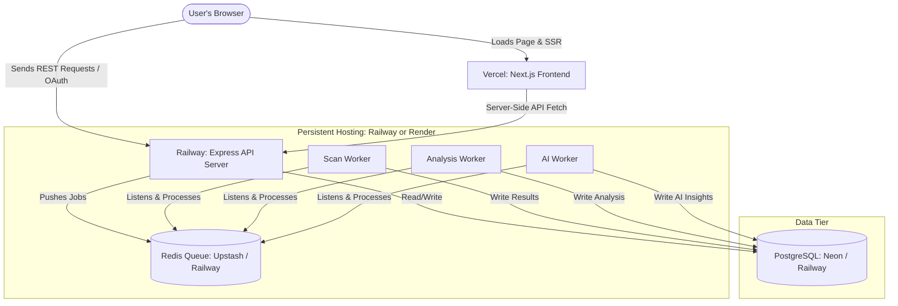

# Hosting Guide: Production Deployment for CI/CD Reliability Intelligence Platform

This guide provides step-by-step instructions for deploying your project to production. 

Currently, your project is organized as a Docker-composed local stack containing:
1. **Frontend (`/dashboard`)**: A Next.js web application.
2. **Backend API (`/backend`)**: An Express server.
3. **Queue / Cache**: A Redis instance.
4. **Database**: A PostgreSQL instance.
5. **Background Workers (`/backend`)**: Three persistent Node.js workers (`scan-worker`, `analysis-worker`, and `ai-worker`) running BullMQ to process pipelines.

---

## 1. Production Architecture Overview

Because your frontend and backend have different execution models, they must be hosted on different platforms:

*   **Next.js Frontend**: Hosted on **Vercel** (serverless, optimized for Next.js, static site delivery, and SSR).
*   **Database (PostgreSQL)**: Hosted on a managed service (e.g., **Neon** or **Supabase** or **Railway Postgres**) rather than raw Docker container volumes to ensure durability, backups, and scalability.
*   **Queue (Redis)**: Hosted on a managed Redis service (e.g., **Upstash** or **Railway Redis**) that supports persistent connections for BullMQ.
*   **Backend API & Workers**: Hosted on a container deployment service (e.g., **Railway** or **Render**). 
    
> [!IMPORTANT]
> **Why Vercel Cannot Host the Backend API and Workers:**
> Vercel is a **serverless** platform. Its serverless functions scale down to zero and have short execution timeouts (10s to 60s). 
> - Your **Express API** is designed to run as a persistent listener.
> - Your **Workers** are persistent, long-running Node.js processes that poll Redis queues using BullMQ. If hosted on Vercel, the workers would shut down and your job queues would never process.
> 
> Therefore, the Backend API and Workers **must** run on a persistent container platform like **Railway** or **Render**.



---

## 2. Step-by-Step Deployment Guide

We recommend using **Railway** for your backend API, workers, and databases because it natively reads Dockerfiles and supports Git-integrated deployments. Alternatively, you can use **Render** or serverless database providers (**Neon** and **Upstash**).

### Step 2.1: Spin up Databases (PostgreSQL & Redis)

#### Option A: Using Railway (Easiest - All-in-One)
If you deploy your API and Workers on Railway, you can create the database dependencies directly in the same Railway project:
1. Log into [Railway.app](https://railway.app) and create a new project.
2. Click **+ Add Service** -> Choose **Database** -> Select **Add PostgreSQL**.
3. Click **+ Add Service** -> Choose **Database** -> Select **Add Redis**.
4. Railway will automatically expose environment variables (like `DATABASE_URL` and `REDIS_URL`) which can be easily referenced by other services in the same project.

#### Option B: Using Dedicated Managed Cloud Providers (Highly Scalable)
*   **PostgreSQL**: Create a free-tier database on [Neon.tech](https://neon.tech) or [Supabase](https://supabase.com). Copy the PostgreSQL connection string.
*   **Redis**: Create a database on [Upstash](https://upstash.com). Upstash provides serverless Redis, which is perfect for BullMQ as it has zero idle cost. Copy the Redis hostname, port, and password.

---

### Step 2.2: Deploy the Backend API on Railway

Your backend API uses the code in `/backend`. Railway will build this using `backend/Dockerfile.worker` (overriding the command) or its Node.js builder.

1. In your Railway project, click **+ Add Service** -> Choose **GitHub Repo**.
2. Select your repository.
3. Once imported, click on the new service, go to **Settings** and configure:
    *   **Source Directory**: Set to `/backend`.
    *   **Build Command**: Railway will auto-detect Node.js. If you want to use the Dockerfile, change the Build Provider to **Dockerfile** (pointing to `Dockerfile.worker` in `/backend`).
    *   **Start Command**: Override the start command to `node dist/server.js`.
4. Go to the **Variables** tab and add the production environment variables:
    ```env
    NODE_ENV=production
    PORT=3000
    DATABASE_URL=your_production_postgresql_connection_string
    DATABASE_SSL=true # Forces SSL for DB (automatically enabled in production unless localhost)
    REDIS_HOST=your_production_redis_host
    REDIS_PORT=your_production_redis_port
    REDIS_PASSWORD=your_production_redis_password
    REDIS_TLS=true  # Set to true if using Upstash / Railway Redis with SSL
    START_WORKERS=false  # CRITICAL: Prevents workers from running inside the API container
    SESSION_SECRET=a_random_64_character_hex_string
    ENCRYPTION_KEY=a_random_32_character_hex_string
    ACCESS_TOKEN_ENCRYPTION_KEY=a_random_32_character_hex_string
    ACCESS_TOKEN_HMAC_SECRET=a_random_32_character_hex_string
    CORS_ORIGIN=https://your-frontend-vercel-domain.vercel.app
    ```
5. Go to **Settings** -> **Networking** and click **Generate Domain**. This will give you a public URL for your API (e.g., `https://your-api.up.railway.app`).

---

### Step 2.3: Deploy the Background Workers on Railway

You need to spin up the 3 background workers (`scan-worker`, `analysis-worker`, and `ai-worker`). They share the same codebase and database connections as the API, but run a different entrypoint.

For **each** worker, repeat the following steps in Railway:
1. Click **+ Add Service** -> Choose **GitHub Repo** (select the same repo).
2. Go to **Settings**:
    *   **Source Directory**: `/backend`.
    *   **Build Provider**: Set to **Dockerfile** (using `Dockerfile.worker` in the backend).
    *   **Start Command**: Keep default (which executes `node dist/workers/worker-manager.js` as defined in the `Dockerfile.worker`'s CMD).
3. Go to the **Variables** tab. Copy all variables from the Backend API service (Railway makes this easy with a "Copy From..." option), and add/modify:
    *   **`START_WORKERS`**: Keep this as `true` (or omit/remove it, as it defaults to `true`).
    *   **`WORKER_TYPE`**: (Crucial: WorkerManager uses this to run only the specific worker type)
        *   For the scan worker: Set to `scan`
        *   For the analysis worker: Set to `analysis`
        *   For the AI worker: Set to `ai`
    *   **`WORKER_CONCURRENCY`**: (e.g., `3` for scan, `5` for analysis, `2` for AI as configured in your compose file).
4. Go to **Settings** -> **General** -> **Scaling**:
    *   Since workers do not handle web requests, they do not need a public domain or port. Ensure they have no public networking enabled to save resources and secure them.
    *   Apply resource limits matching your local compose configuration:
        *   **Scan worker**: Limit to `0.5 - 1.0` vCPU and `512MB` RAM.
        *   **Analysis worker**: Limit to `0.5` vCPU and `256MB` RAM.
        *   **AI worker**: Limit to `0.5` vCPU and `1GB` RAM (if parsing heavy models).

---

### Step 2.4: Run Database Migrations

Before launching the services, you must apply the database schema schema using Drizzle ORM.

#### Option A: Run manually from your local terminal
You can run the migrations directly against your production database from your local machine:
1. Temporarily replace the `DATABASE_URL` in your local `backend/.env` file with the production connection string.
2. In the `backend/` directory, run:
   ```bash
   pnpm run db:migrate
   ```
3. Revert your local `backend/.env` file back to the localhost database.

#### Option B: Automated migrations in CI/CD (Recommended)
Add a pre-deploy phase to your Backend API service on Railway:
1. In the Backend API service **Settings** -> **Builds**, look for a **Pre-Deploy Command** (or custom build script).
2. Set the pre-deploy command to:
   ```bash
   npm run build && npm run db:migrate
   ```
   This will automatically apply any new Drizzle migrations before the new backend container code goes live.

---

### Step 2.5: Deploy the Frontend on Vercel

1. Log into [Vercel](https://vercel.com) and click **Add New** -> **Project**.
2. Select your GitHub repository.
3. In the project configuration, customize the following settings:
    *   **Framework Preset**: Select **Next.js**.
    *   **Root Directory**: Set to `dashboard` (Vercel will build and deploy only the Next.js app in this subfolder).
    *   **Build Command**: `npm run build`
    *   **Install Command**: `npm install`
4. Expand **Environment Variables** and add:
    *   **`NEXT_PUBLIC_API_URL`**: Set this to the public URL generated for your Backend API on Railway (e.g., `https://your-api.up.railway.app`).
5. Click **Deploy**.

---

## 3. Post-Deployment Checklist

### 🔑 Secret Generation
Ensure all secrets are strong, random strings. You can generate cryptographically secure keys locally in your terminal using:
```bash
node -e "console.log(require('crypto').randomBytes(32).toString('hex'))"
```
Use this to generate fresh strings for:
*   `SESSION_SECRET` (64 bytes)
*   `ENCRYPTION_KEY` (32 bytes)
*   `ACCESS_TOKEN_ENCRYPTION_KEY` (32 bytes)
*   `ACCESS_TOKEN_HMAC_SECRET` (32 bytes)

### 🌐 GitHub Integration Callbacks
If you are using GitHub OAuth or GitHub App integration, you must update the callback URLs in the GitHub Developer settings:
*   **OAuth Callback**: Update from `http://localhost:3000/auth/github/callback` to `https://your-api.up.railway.app/auth/github/callback`.
*   **App Webhook URL**: Set to `https://your-api.up.railway.app/webhooks/github` (or whatever webhook endpoint you've defined in the backend routing).
*   **App Homepage URL**: Set to `https://your-app.vercel.app` (your Vercel frontend domain).

---

## 💡 Troubleshooting Tips

*   **BullMQ Connection Failures**: If your workers or API fail to start with a Redis connection error, verify that `REDIS_TLS` is set to `true` (many managed Redis services like Upstash require SSL/TLS to connect).
*   **CORS Blockages**: If the frontend fails to load data or log in, check the API server logs. Verify that the `CORS_ORIGIN` variable in your Backend API matches your Vercel deployment URL exactly (without a trailing slash).
*   **Migrations Not Found**: Ensure that the `drizzle/` migration folder is committed to your repository so the production server can access it to run `db:migrate`.
