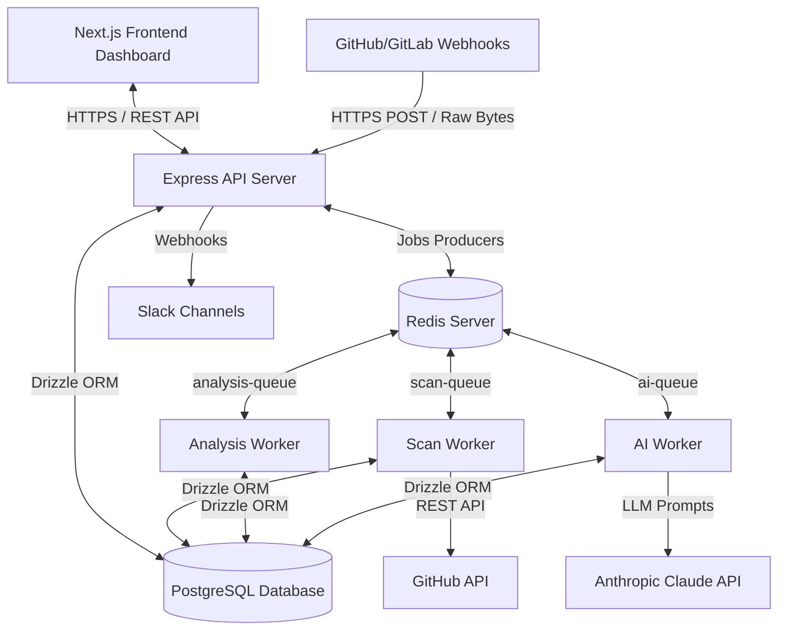

# CI/CD Reliability & Intelligence Platform — Complete Project Documentation

This document provides a highly detailed, production-grade reference guide to the **CI/CD Reliability & Intelligence Platform**. It is designed for engineers, maintainers, and developers to understand the architecture, database schema, API specification, job routing pipelines, and rules execution logic of the platform.

---

## 1. System Architecture & High-Level Flow

The platform is designed around a decoupled, asynchronous, worker-based architecture to process compute-heavy CI/CD file parsing, security checking, and large language model (LLM) diagnostics. It comprises an Express API gateway, a Next.js 14 single-page application dashboard, a PostgreSQL database, a Redis-backed BullMQ messaging layer, and independent execution workers.



### End-to-End Execution Lifecycle:
1. **Ingestion & Inception**:
   - A scan is triggered manually (via the UI), automatically (via Git push/PR webhooks), or scheduled (via cron).
   - The Express API creates a scan record in the database with `status = 'queued'` and registers a job in BullMQ's `scan-queue` containing repository access tokens and target branches.
2. **Cloning & Parsing (`scan-queue` / `ScanWorker`)**:
   - The `ScanWorker` retrieves the repository's configuration.
   - It fetches repository files locally or through repository API endpoints (like GitHub's contents API), ignoring paths matched in the project's `.gitignore` or user-defined `ignorePaths` configurations.
   - It runs files matching supported patterns through dedicated parser modules (e.g. GitHub Actions YAML parser, GitLab CI parser, Dockerfile parser, Docker Compose parser, Jenkinsfile parser, or Kubernetes YAML parser) to generate a **Schema-Normalized Workflow AST**.
   - These AST records are stored in the `parsed_artifacts` table.
   - Upon completion, the worker enqueues a `RunRules` job in the `analysis-queue`.
3. **Linting & Risk Scoring (`analysis-queue` / `AnalysisWorker`)**:
   - The `AnalysisWorker` runs the enqueued rules engine (managed by `RuleRunner`) against the normalized workflow ASTs.
   - It records specific violations into the `findings` table.
   - It executes the `RiskScorer` component, which calculates numerical risk scores and letter grades (A, B, C, D, F) for each workflow individually, and rolls up an aggregated score for the entire repository.
   - The worker compiles a report and stores it in the `analysis_reports` table.
   - If findings are severe (e.g., any critical findings or an overall risk score $\ge$ 40), the worker pushes a job to the `ai-queue`.
4. **AI-Powered Diagnostics (`ai-queue` / `AIWorker`)**:
   - The `AIWorker` pulls the report and code snippets, compiling a structured prompt for the **Anthropic Claude API**.
   - It generates deep explanations, risk context, failure simulation scenarios, and concrete remediation code patches (before/after).
   - It passes the output through structural validators to clean up formatting.
   - Finally, it commits these objects into the `ai_explanations`, `ai_remediations`, and `ai_predictions` tables, updating the scan status to `completed`.
5. **Alerts Dispatch**:
   - The Express API or workers trigger webhooks (e.g. Slack messages) depending on configuration rules to inform teams of new findings.

---

## 2. Database Schema (PostgreSQL + Drizzle ORM)

The database schema is written using Drizzle ORM schema builders in [schema.ts](file:///w:/newIdea/backend/src/db/schema.ts). It enforces strict constraints and cascades to ensure data integrity.

### 2.1 Enumerated Types (`pgEnum`)
- **`provider`**: Represents repository hosting systems. Values: `'github'`, `'gitlab'`, `'gitea'`, `'self-hosted'`.
- **`repo_status`**: Active monitoring state. Values: `'active'`, `'paused'`, `'error'`.
- **`scan_status`**: Pipeline status of a scan job. Values: `'queued'`, `'running'`, `'completed'`, `'failed'`, `'cancelled'`.
- **`severity`**: Priority weight of a lint violation. Values: `'critical'`, `'high'`, `'medium'`, `'low'`, `'info'`.
- **`category`**: Classification category of a rule. Values: `'security'`, `'reliability'`, `'performance'`, `'maintainability'`.

### 2.2 Tables Catalog

#### 1. `repos` (Monitored Repositories)
Stores target repositories, auth credentials, and tracking configurations.
* **`id`** (`uuid`, Primary Key): Unique repository identifier.
* **`repo_url`** (`text`, Unique, Not Null): Full HTTPS/Git URL of the repository.
* **`name`** (`text`, Not Null): Display name of the repository (e.g. `owner/repo-name`).
* **`provider`** (`provider` enum, Not Null): The hosting provider.
* **`owner`** (`text`, Not Null): Username or organization owner.
* **`repo_name`** (`text`, Not Null): Simple name of the repository.
* **`default_branch`** (`text`, Not Null, Default: `'main'`): Target branch for monitoring.
* **`settings`** (`jsonb`, Not Null, Default: `{}`): Custom settings (e.g., `autoScanOnPush: boolean`, `scanSchedule: string`, `notifyOnCritical: boolean`, `ignorePaths: string[]`).
* **`status`** (`repo_status` enum, Not Null, Default: `'active'`): Operational monitoring state.
* **`created_at`** (`timestamp with time zone`, Not Null, Default: `now()`): Creation timestamp.
* **`updated_at`** (`timestamp with time zone`, Not Null, Default: `now()`): Last settings change timestamp.
* **`last_scanned_at`** (`timestamp with time zone`, Nullable): Completion timestamp of the last successful scan.
* **`total_scans`** (`integer`, Not Null, Default: `0`): Running total of all executions.

#### 2. `scans` (Scan Runs Execution Logs)
Tracks runs, timings, branch references, and final scoring counts.
* **`id`** (`uuid`, Primary Key): Unique scan identifier.
* **`repo_id`** (`uuid`, Foreign Key -> `repos.id`, Not Null): Associated repository.
* **`status`** (`scan_status` enum, Not Null, Default: `'running'`): Execution phase.
* **`branch`** (`text`, Not Null): Name of the branch scanned.
* **`created_at`** (`timestamp with time zone`, Not Null, Default: `now()`): Inception timestamp.
* **`updated_at`** (`timestamp with time zone`, Not Null, Default: `now()`): Status change timestamp.
* **`triggered_at`** (`timestamp with time zone`, Not Null, Default: `now()`): Time the scan was enqueued.
* **`completed_at`** (`timestamp with time zone`, Nullable): Completion timestamp of the scan.
* **`duration_ms`** (`integer`, Nullable): Timed duration in milliseconds.
* **`total_files`** (`integer`, Not Null, Default: `0`): Count of target configuration files parsed.
* **`total_findings`** (`integer`, Not Null, Default: `0`): Overall findings detected.
* **`critical_count`** (`integer`, Not Null, Default: `0`): Count of critical findings.
* **`high_count`** (`integer`, Not Null, Default: `0`): Count of high findings.
* **`medium_count`** (`integer`, Not Null, Default: `0`): Count of medium findings.
* **`low_count`** (`integer`, Not Null, Default: `0`): Count of low findings.
* **`error_message`** (`text`, Nullable): Stores error information or stack traces if execution fails.

#### 3. `parsed_artifacts` (Parsed Configurations AST)
Stores normalized intermediate representations of configuration structures.
* **`id`** (`uuid`, Primary Key): Unique artifact identifier.
* **`scan_id`** (`uuid`, Foreign Key -> `scans.id`, Not Null): Associated scan run.
* **`repo_id`** (`uuid`, Foreign Key -> `repos.id`, Not Null): Associated repository.
* **`file_path`** (`text`, Not Null): Project relative path of target file (e.g. `.github/workflows/ci.yml`).
* **`file_type`** (`text`, Not Null): Config parser identifier (e.g. `'github-actions'`, `'dockerfile'`).
* **`normalized_workflow`** (`jsonb`, Nullable): Schema-normalized workflow object (jobs, steps, triggers, dependencies).
* **`parse_errors`** (`jsonb`, Not Null, Default: `[]`): Compilation errors encountered during parser execution.
* **`parse_warnings`** (`jsonb`, Not Null, Default: `[]`): Deprecations or syntactic alerts.
* **`parsed_at`** (`timestamp with time zone`, Not Null, Default: `now()`): Parse completion timestamp.

#### 4. `findings` (Violation Log)
Individual rule violations detected during the analysis phase.
* **`id`** (`uuid`, Primary Key): Unique finding identifier.
* **`scan_id`** (`uuid`, Foreign Key -> `scans.id`, Not Null): Scan identifier.
* **`repo_id`** (`uuid`, Foreign Key -> `repos.id`, Not Null): Repository identifier.
* **`artifact_id`** (`uuid`, Foreign Key -> `parsed_artifacts.id`, Nullable): Associated artifact configuration.
* **`file_path`** (`text`, Not Null): File containing the violation.
* **`rule_id`** (`text`, Not Null): Associated rule identifier.
* **`title`** (`text`, Not Null): Human-readable name of the violation.
* **`severity`** (`severity` enum, Not Null): Risk priority level.
* **`category`** (`category` enum, Not Null): Category classification.
* **`description`** (`text`, Not Null): Deep explanation of what was violated.
* **`field`** (`text`, Nullable): YAML/Config path pointing to the issue (e.g. `jobs.build.steps.0`).
* **`line`** (`integer`, Nullable): line number location in original file.
* **`remediation`** (`text`, Nullable): Suggested fixes.
* **`created_at`** (`timestamp with time zone`, Not Null, Default: `now()`): Creation timestamp.

#### 5. `workflows` (Legacy Workflows Table)
Kept for backward compatibility.
* **`id`** (`uuid`, Primary Key): Unique legacy workflow identifier.
* **`source`** (`text`, Not Null): Pipeline engine source identifier (e.g. `'github'`).
* **`source_file`** (`text`, Not Null): Configuration source file path.
* **`repo_id`** (`text`, Not Null): Repository ID string.
* **`parsed_at`** (`timestamp with time zone`, Not Null): Timestamp of parsing.
* **`total_jobs`** (`integer`, Not Null, Default: `0`): Count of defined jobs.
* **`total_steps`** (`integer`, Not Null, Default: `0`): Count of steps.
* **`has_secrets`** (`boolean`, Not Null, Default: `false`): Secret exposure flag.
* **`has_docker_images`** (`boolean`, Not Null, Default: `false`): Presence of base docker configuration.
* **`has_external_actions`** (`boolean`, Not Null, Default: `false`): Action references flag.
* **`payload`** (`jsonb`, Not Null): Original parsed AST structure.
* **`created_at`** (`timestamp with time zone`, Not Null, Default: `now()`): Record creation timestamp.

#### 6. `ai_explanations` (AI Diagnostic Contexts)
Stores descriptive interpretations of findings generated by Claude.
* **`id`** (`uuid`, Primary Key): Unique record identifier.
* **`scan_id`** (`uuid`, Not Null): Scan identifier.
* **`repo_id`** (`uuid`, Not Null): Repository identifier.
* **`rule_id`** (`text`, Nullable): Rule ID associated with this explanation.
* **`explanation`** (`text`, Not Null): Markdown narrative of risks.
* **`risk_context`** (`text`, Nullable): Technical and business risks.
* **`urgency`** (`text`, Nullable): Remediation guidance timeline (e.g. "immediate", "next-release").
* **`created_at`** (`timestamp with time zone`, Not Null, Default: `now()`): Creation timestamp.

#### 7. `ai_remediations` (AI Code Fixes)
Stores generated and validated patches.
* **`id`** (`uuid`, Primary Key): Unique record identifier.
* **`scan_id`** (`uuid`, Not Null): Associated scan.
* **`repo_id`** (`uuid`, Not Null): Associated repository.
* **`rule_id`** (`text`, Nullable): Associated rule ID.
* **`title`** (`text`, Not Null): Short name of the patch.
* **`before_code`** (`text`, Nullable): Original code snippet block.
* **`after_code`** (`text`, Nullable): Pinned/fixed code snippet block.
* **`language`** (`text`, Nullable): Code syntax styling (e.g. `'yaml'`, `'dockerfile'`).
* **`instructions`** (`text`, Nullable): Execution list to apply changes.
* **`safe`** (`boolean`, Nullable): True if the changes are validated as safe to apply without breakage.
* **`warning`** (`text`, Nullable): Side-effect warnings.
* **`created_at`** (`timestamp with time zone`, Not Null, Default: `now()`): Creation timestamp.

#### 8. `ai_predictions` (Failure Mode Simulation Logs)
Stores failure simulation details generated by the AI.
* **`id`** (`uuid`, Primary Key): Unique prediction identifier.
* **`scan_id`** (`uuid`, Not Null): Scan run identifier.
* **`repo_id`** (`uuid`, Not Null): Repository identifier.
* **`rule_id`** (`text`, Nullable): Rule ID associated with this prediction.
* **`scenario`** (`text`, Not Null): Narrative detailing the failure.
* **`trigger`** (`text`, Nullable): Triggers or conditions that cause this failure.
* **`impact`** (`text`, Nullable): Consequences (e.g. "runner queue hangs", "leaked deployment keys").
* **`likelihood`** (`text`, Nullable): Estimated probability.
* **`time_to_failure`** (`text`, Nullable): Expected time before this failure occurs.
* **`created_at`** (`timestamp with time zone`, Not Null, Default: `now()`): Creation timestamp.

#### 9. `analysis_reports` (Aggregated Findings Cache)
Summary of the scan results.
* **`id`** (`uuid`, Primary Key): Unique report identifier.
* **`scan_id`** (`uuid`, Not Null): Associated scan run.
* **`repo_id`** (`uuid`, Not Null): Associated repository.
* **`overall_score`** (`integer`, Not Null): Evaluated repository risk score.
* **`risk_grade`** (`text`, Not Null): Grade letter output (`A`, `B`, `C`, `D`, or `F`).
* **`critical_count`** (`integer`, Not Null, Default: `0`): Critical severity total.
* **`high_count`** (`integer`, Not Null, Default: `0`): High severity total.
* **`medium_count`** (`integer`, Not Null, Default: `0`): Medium severity total.
* **`low_count`** (`integer`, Not Null, Default: `0`): Low severity total.
* **`report_json`** (`text`, Not Null): Serialized JSON contents containing full report trees.
* **`created_at`** (`timestamp with time zone`, Not Null, Default: `now()`): Creation timestamp.

---

## 3. Backend REST API Endpoints Reference

All routes are mounted under the `/api` prefix, with the exception of the raw GitHub webhook endpoint which runs on `/webhooks/github`.

### 3.1 Repository Management (`/api/repos`)

#### `POST /api/repos`
- **Description**: Add a new repository to monitor.
- **Validation**: Handles inputs via `registerSchema` (Zod). Enforces URL structures matching GitHub/GitLab or ending in `.git`.
- **Request Body (JSON)**:
  ```json
  {
    "repoUrl": "https://github.com/myorg/my-project.git",
    "name": "myorg/my-project",
    "provider": "github",
    "defaultBranch": "main",
    "githubToken": "ghp_xxxxxxxxxxxx",
    "settings": {
      "autoScanOnPush": true,
      "scanSchedule": "0 0 * * *",
      "notifyOnCritical": true,
      "ignorePaths": ["**/test/**", "node_modules/**"]
    }
  }
  ```
- **Response (`201 Created`)**:
  ```json
  {
    "success": true,
    "message": "Repository registered successfully",
    "data": {
      "id": "e0bcf772-a083-4a1d-a0bb-d3f3f03b22cf",
      "repoUrl": "https://github.com/myorg/my-project.git",
      "name": "myorg/my-project",
      "provider": "github",
      "owner": "myorg",
      "repoName": "my-project",
      "defaultBranch": "main",
      "settings": {
        "autoScanOnPush": true,
        "scanSchedule": "0 0 * * *",
        "notifyOnCritical": true,
        "ignorePaths": ["**/test/**", "node_modules/**"]
      },
      "status": "active",
      "createdAt": "2026-05-22T12:00:00.000Z",
      "updatedAt": "2026-05-22T12:00:00.000Z",
      "totalScans": 0
    },
    "timestamp": "2026-05-22T12:00:00.000Z"
  }
  ```
- **Errors**: `409 Conflict` (if repository URL already registered), `422 Unprocessable` (if Zod validation fails).

#### `GET /api/repos`
- **Description**: Fetch monitored repositories with paginated output.
- **Query Parameters**:
  - `page`: default `1`.
  - `limit`: default `20`.
  - `provider`: optional filter (`github` | `gitlab` | `gitea` | `self-hosted`).
  - `status`: optional filter (`active` | `paused` | `error`).
  - `search`: search name and URL strings.
- **Response (`200 OK`)**:
  ```json
  {
    "success": true,
    "data": {
      "repos": [
        {
          "id": "e0bcf772-a083-4a1d-a0bb-d3f3f03b22cf",
          "name": "myorg/my-project",
          ...
        }
      ],
      "pagination": {
        "page": 1,
        "limit": 20,
        "total": 1,
        "totalPages": 1,
        "hasNext": false,
        "hasPrev": false
      }
    },
    "timestamp": "2026-05-22T12:01:00.000Z"
  }
  ```

#### `GET /api/repos/:id`
- **Description**: Get repository settings and metadata from its latest scan.
- **Response (`200 OK`)**:
  ```json
  {
    "success": true,
    "data": {
      "id": "e0bcf772-a083-4a1d-a0bb-d3f3f03b22cf",
      "repoUrl": "https://github.com/myorg/my-project.git",
      "name": "myorg/my-project",
      "provider": "github",
      "owner": "myorg",
      "repoName": "my-project",
      "defaultBranch": "main",
      "settings": { ... },
      "status": "active",
      "createdAt": "2026-05-22T12:00:00.000Z",
      "updatedAt": "2026-05-22T12:00:00.000Z",
      "totalScans": 1,
      "latestScan": {
        "id": "e4468f7b-6078-4367-be38-5cf0f699042b",
        "status": "completed",
        "scannedAt": "2026-05-22T12:05:00.000Z",
        "duration": 4820,
        "totalFindings": 5,
        "critical": 0,
        "high": 1,
        "medium": 2,
        "low": 2
      }
    },
    "timestamp": "2026-05-22T12:06:00.000Z"
  }
  ```

#### `PATCH /api/repos/:id`
- **Description**: Update repository configurations.
- **Request Body (JSON)**:
  ```json
  {
    "name": "Updated name",
    "status": "paused",
    "settings": {
      "autoScanOnPush": false
    }
  }
  ```
- **Response (`200 OK`)**: Updated repository object.

#### `DELETE /api/repos/:id`
- **Description**: Delete a repository. Triggers cascade deletion of scans, findings, and parsed configurations.
- **Response (`200 OK`)**:
  ```json
  {
    "success": true,
    "message": "Repository and all associated scans deleted",
    "data": null,
    "timestamp": "2026-05-22T12:07:00.000Z"
  }
  ```

---

### 3.2 Ingestions & Scans (`/api/repos/:id/scan` and `/api/repos/:id/scans`)

#### `POST /api/repos/:id/scan`
- **Description**: Manually trigger a repository scan. If a scan is already running for the branch, returns the active scan.
- **Request Body (JSON)**:
  ```json
  {
    "branch": "main",
    "priority": 2,
    "triggeredBy": "manual",
    "targetFiles": ["Dockerfile", ".github/workflows/ci.yml"]
  }
  ```
- **Response (`202 Accepted`)**:
  ```json
  {
    "success": true,
    "message": "Scan queued successfully",
    "data": {
      "scanId": "e4468f7b-6078-4367-be38-5cf0f699042b",
      "jobId": "scan:e4468f7b-6078-4367-be38-5cf0f699042b:fetch",
      "queue": "scan-queue",
      "status": "queued",
      "pollUrl": "/api/jobs/scan:e4468f7b-6078-4367-be38-5cf0f699042b:fetch/status"
    },
    "timestamp": "2026-05-22T12:10:00.000Z"
  }
  ```

#### `POST /api/repos/:id/rescan`
- **Description**: Queue a rescan referencing a previous scan run or default branch configurations.
- **Request Body (JSON)**:
  ```json
  {
    "previousScanId": "e4468f7b-6078-4367-be38-5cf0f699042b",
    "branch": "main",
    "priority": 2
  }
  ```
- **Response (`202 Accepted`)**: Returns new job enqueuing coordinates.

#### `GET /api/repos/:id/scans/latest`
- **Description**: Get latest completed scan details, findings, and parsed artifacts metadata.
- **Response (`200 OK`)**:
  ```json
  {
    "success": true,
    "data": {
      "scan": {
        "id": "e4468f7b-6078-4367-be38-5cf0f699042b",
        "status": "completed",
        "totalFiles": 1,
        "totalFindings": 1,
        ...
      },
      "findings": {
        "summary": { "total": 1, "critical": 0, "high": 1, "medium": 0, "low": 0 },
        "byFile": {
          "Dockerfile": [
            {
              "id": "5f9fa3c4-1180-4cf8-a90b-1936e78832a1",
              "ruleId": "reliability-floating-docker-tag",
              "title": "Floating Docker Tag",
              "severity": "high",
              "category": "reliability",
              "description": "Base image is using tag 'latest'",
              "line": 1,
              "remediation": "Pin base image to specific digest or exact semver tag"
            }
          ]
        },
        "all": [...]
      },
      "artifacts": [
        { "filePath": "Dockerfile", "fileType": "dockerfile", "parseErrors": [], "parseWarnings": [] }
      ]
    },
    "timestamp": "2026-05-22T12:11:00.000Z"
  }
  ```

#### `GET /api/repos/:id/scans/:scanId`
- **Description**: Retrieve detailed findings and parsed artifacts for a specific scan.
- **Response (`200 OK`)**: Structure identical to `/scans/latest`.

#### `POST /api/repos/:id/scans/:scanId/rerun`
- **Description**: Re-runs a specific scan.
- **Response (`202 Accepted`)**: Returns queue tracking parameters.

#### `GET /api/repos/:id/scans`
- **Description**: Retrieve list of historical scans.
- **Query Params**: `page` (default 1), `limit` (default 10), `status`, `branch`.
- **Response (`200 OK`)**: Paginated scan records list.

---

### 3.3 Background Jobs Status (`/api/jobs`)

#### `GET /api/jobs/:jobId/status`
- **Description**: Poll the execution status and progress of a worker job.
- **Response (`200 OK`)**:
  ```json
  {
    "success": true,
    "data": {
      "jobId": "scan:e4468f7b-6078-4367-be38-5cf0f699042b:fetch",
      "status": "active",
      "progress": 45,
      "queue": "scan-queue",
      "attemptsMade": 1
    },
    "timestamp": "2026-05-22T12:12:00.000Z"
  }
  ```

#### `POST /api/jobs/:jobId/retry`
- **Description**: Trigger retry for a failed job.
- **Response (`200 OK`)**:
  ```json
  { "success": true, "message": "Job retry initiated" }
  ```

#### `DELETE /api/jobs/:jobId`
- **Description**: Cancel a queued or delayed job.
- **Response (`200 OK`)**:
  ```json
  { "success": true, "message": "Job cancelled successfully" }
  ```

---

### 3.4 AI Diagnostics (`/api/scans/:scanId/explain`, `/api/scans/:scanId/remediate`, `/api/scans/:scanId/ai-report`, `/api/findings/:findingId/explain`, `/api/findings/:findingId/predict`)

These endpoints kick off heavy Anthropic LLM evaluation runs. They return `202 Accepted` and expose status URLs.

#### `POST /api/scans/:scanId/explain`
- **Description**: Kick off plain English risk analysis and business impact explanation generation.
- **Response (`202 Accepted`)**:
  ```json
  {
    "success": true,
    "message": "Explanation generation started",
    "data": {
      "jobId": "ai:e4468f7b-6078-4367-be38-5cf0f699042b:explain-scan",
      "scanId": "e4468f7b-6078-4367-be38-5cf0f699042b",
      "status": "pending",
      "pollUrl": "/api/scans/e4468f7b-6078-4367-be38-5cf0f699042b/explain/ai:e4468f7b-6078-4367-be38-5cf0f699042b:explain-scan"
    },
    "timestamp": "2026-05-22T12:15:00.000Z"
  }
  ```

#### `GET /api/scans/:scanId/explain/:jobId`
- **Description**: Retrieve results of generated explanations.
- **Response (`200 OK` when completed)**:
  ```json
  {
    "success": true,
    "data": {
      "jobId": "ai:e4468f7b-6078-4367-be38-5cf0f699042b:explain-scan",
      "status": "completed",
      "explanation": "This scan reveals vulnerabilities...",
      "findingExplanations": [
        {
          "ruleId": "security-secret-exposure",
          "plainEnglishRisk": "Hardcoded API Token in config",
          "businessImpact": "Credentials leaked to log search indices.",
          "confidence": "certain"
        }
      ],
      "completedAt": "2026-05-22T12:20:00.000Z",
      "costUsd": 0.0125
    },
    "timestamp": "2026-05-22T12:20:01.000Z"
  }
  ```

#### `POST /api/scans/:scanId/remediate`
- **Description**: Kick off generation of code patches with safety assessments.
- **Response (`202 Accepted`)**: Returns tracking metadata coordinates.

#### `GET /api/scans/:scanId/remediate/:jobId`
- **Description**: Retrieve results of remediations.
- **Response (`200 OK` when completed)**:
  ```json
  {
    "success": true,
    "data": {
      "jobId": "ai:e4468f7b-6078-4367-be38-5cf0f699042b:remediate",
      "status": "completed",
      "remediationReport": {
        "remediations": [
          {
            "findingRuleId": "reliability-floating-docker-tag",
            "aiPatch": {
              "title": "Pin Docker Tag",
              "before": "FROM node:latest",
              "after": "FROM node:18.19.0-alpine@sha256:xxxxxxxxxxxx",
              "language": "dockerfile",
              "instructions": "Replace node:latest with pinned digest.",
              "safe": true,
              "warning": null
            }
          }
        ]
      },
      "guardrailResults": {
        "total": 1,
        "approved": 1,
        "rejected": 0,
        "fallbacksUsed": 0
      },
      "patchesReady": 1,
      "completedAt": "2026-05-22T12:22:00.000Z",
      "costUsd": 0.0341
    },
    "timestamp": "2026-05-22T12:22:01.000Z"
  }
  ```

#### `POST /api/scans/:scanId/ai-report`
- **Description**: Kick off full AI analysis (Explanations, Remediations, and Predictions).
- **Response (`202 Accepted`)**: Returns task tracking metadata.

#### `GET /api/scans/:scanId/ai-report/:jobId`
- **Description**: Fetch full AI analysis results.
- **Response (`200 OK` when completed)**: Returns explanations, remediations, predictions, and cost statistics.

#### `GET /api/scans/:scanId/ai-report/:jobId/status`
- **Description**: Gets progress metrics and estimation values.
- **Response (`200 OK`)**:
  ```json
  {
    "success": true,
    "data": {
      "jobId": "ai:e4468f7b-6078-4367-be38-5cf0f699042b:full-report",
      "status": "running",
      "progress": 45,
      "currentPhase": "prediction",
      "estimatedSecondsRemaining": 15.5
    },
    "timestamp": "2026-05-22T12:22:15.000Z"
  }
  ```

#### `POST /api/findings/:findingId/explain`
- **Description**: Explain a single finding synchronously.
- **Response (`200 OK`)**: Returns finding explanation, business impact, and token cost details.

#### `POST /api/findings/:findingId/predict`
- **Description**: Simulate failure scenarios for a single finding synchronously.
- **Response (`200 OK`)**: Returns simulated scenario writeups and likelihood ratings.

---

### 3.5 Operational & Monitoring (`/api/queue`)

#### `GET /api/queue/stats`
- **Description**: Active jobs counters on BullMQ queues (`scan`, `analysis`, `ai`) and Redis liveness metrics.
- **Response (`200 OK`)**:
  ```json
  {
    "success": true,
    "data": {
      "queues": {
        "scan": { "waiting": 0, "active": 0, "completed": 210, "failed": 2, "delayed": 0 },
        "analysis": { "waiting": 0, "active": 0, "completed": 194, "failed": 0, "delayed": 0 },
        "ai": { "waiting": 0, "active": 0, "completed": 45, "failed": 1, "delayed": 0 }
      },
      "redis": { "healthy": true, "latencyMs": 1.4 }
    },
    "timestamp": "2026-05-22T12:30:00.000Z"
  }
  ```

#### `GET /api/queue/failed`
- **Description**: List the last 20 failed jobs across all queues with their error messages and stack traces.
- **Response (`200 OK`)**: Contains job payloads and error stack trace arrays.

#### `POST /api/queue/retry-failed`
- **Description**: Retries failed jobs.
- **Request Body (JSON, Optional)**: `{ "queue": "scan" }` (omits to retry all queues).
- **Response (`200 OK`)**: Returns the count of retried jobs.

#### `DELETE /api/queue/clean`
- **Description**: Clean completed or failed jobs.
- **Query Params**: `hours` (number, default: 24), `status` (`completed` \| `failed`).
- **Response (`200 OK`)**: Returns the count of cleaned jobs.

---

### 3.6 GitHub Webhooks & Integrations

#### `POST /webhooks/github` (Raw Event Receiver)
- **Description**: Receives push and pull request webhooks from GitHub.
- **Implementation Rules**:
  - Uses `express.raw({ type: '*/*' })` middleware to process incoming payloads as raw `Buffer` streams.
  - Generates an HMAC-SHA256 signature using the raw body and the configured `GITHUB_WEBHOOK_SECRET` token to verify against the `x-hub-signature-256` header.
  - Verifies the `x-github-delivery` header to prevent duplicate message deliveries.
  - Returns `202 Accepted` immediately without waiting for workers.
- **Events**:
  - `ping`: Verifies connection settings.
  - `push`: Parses modified paths and enqueues a new scan.
  - `pull_request`: Triggers a PR check run analysis and enqueues a scan.

#### `GET /api/github-app/setup`
- **Description**: Returns installation coordinates for setup.
- **Response (`200 OK`)**: `{ "installUrl": "https://github.com/apps/slug/installations/new" }`

#### `GET /api/github-app/callback`
- **Description**: Receives redirected installation IDs from GitHub. Redirects back to dashboard settings integrations path.

#### `POST /api/github-app/webhook`
- **Description**: Internal handler for App permissions, installations, and check runs.

#### `POST /api/integrations/slack/test`
- **Description**: Validates Slack webhook connections.
- **Request Body (JSON)**: `{ "webhookUrl": "https://hooks.slack.com/services/..." }`
- **Response (`200 OK`)**: `{ "success": true }`

---

### 3.7 System Health & Metrics

#### `GET /health`
- **Description**: Returns quick uptime status. Used for container healthchecks.

#### `GET /api/health`
- **Description**: Returns deep health diagnostic data (DB liveness, Redis latency, worker counters, and disk space usage).
- **Response (`200 OK` when healthy)**:
  ```json
  {
    "success": true,
    "data": {
      "status": "healthy",
      "services": {
        "postgres": { "status": "healthy" },
        "redis": { "status": "healthy", "latencyMs": 1.1 },
        "workers": { "scan": "running", "analysis": "running", "ai": "running" }
      }
    },
    "timestamp": "2026-05-22T12:35:00.000Z"
  }
  ```

#### `GET /api/metrics`
- **Description**: Performance metrics for dashboards (average execution durations, failure rates, and scanner loads).

---

## 4. Global Error Handling & Error Shapes

The application uses custom error types and a global error handling middleware defined in [error-handler.ts](file:///w:/newIdea/backend/src/middleware/error-handler.ts).

### 4.1 Custom Error Types (`AppError`)
Custom exceptions extending the base JavaScript `Error` contain explicit HTTP status codes, application-specific error codes, and structured metadata.

```typescript
export class AppError extends Error {
  constructor(
    public statusCode: number,
    public override message: string,
    public code: string,
    public details?: unknown
  ) { ... }
}
```

### 4.2 Error Responses

#### 1. Zod Validation Error (`422 Unprocessable Entity`)
Occurs when request payloads violate input schemas.
```json
{
  "success": false,
  "error": "Validation failed",
  "code": "VALIDATION_ERROR",
  "details": [
    { "field": "repoUrl", "message": "URL must be a GitHub, GitLab, or a .git URL" }
  ]
}
```

#### 2. Unique Constraint Violation (`409 Conflict`)
Occurs when trying to register a repository with an existing URL.
```json
{
  "success": false,
  "error": "Resource already exists",
  "code": "DUPLICATE"
}
```

#### 3. Database Connection Error (`503 Service Unavailable`)
```json
{
  "success": false,
  "error": "Database unavailable",
  "code": "DB_UNAVAILABLE"
}
```

#### 4. Generic Internal Error (`500 Internal Server Error`)
In development, includes detailed stack traces. In production, hides internals.
```json
{
  "success": false,
  "error": "Internal server error",
  "code": "INTERNAL_ERROR"
}
```

---

## 5. Background Queues & Workers (BullMQ)

The background task layer relies on **BullMQ** running on top of **Redis**.

```
                  [ API Server ]
                        │
         ┌──────────────┼──────────────┐
         │ (Enqueue)    │ (Enqueue)    │ (Enqueue)
         ▼              ▼              ▼
     [ scan ]      [ analysis ]     [ ai ]       (Queues)
         │              │              │
         ▼              ▼              ▼
     (ScanWorker) (AnalysisWorker)  (AIWorker)    (Workers)
```

### 5.1 Queues Configuration

#### 1. `scan-queue` (Fetching & Parsing)
- **Worker File**: `scan.worker.ts`
- **Concurrency**: `5` concurrent jobs.
- **Retry Strategy**: `3` retries max, using Exponential backoff with `5000` ms initial delay.
- **Responsibilities**: Cloning repository code, locating configuration files, executing structural parsers, building AST outputs, and enqueuing analysis runs.

#### 2. `analysis-queue` (Rules Execution)
- **Worker File**: `analysis.worker.ts`
- **Concurrency**: `3` concurrent jobs.
- **Retry Strategy**: `2` retries max, using Fixed delay with `2000` ms delay.
- **Responsibilities**: Executing the rules engine, logging findings, calculating scores/grades, and enqueuing AI diagnostics for high-risk scans.

#### 3. `ai-queue` (AI Reasoning)
- **Worker File**: `ai.worker.ts`
- **Concurrency**: `2` concurrent jobs.
- **Retry Strategy**: `2` retries max, using Exponential backoff with `10000` ms initial delay.
- **Responsibilities**: Generating explanations, failure predictions, and verified code remediations using Claude.

---

## 6. Rules Engine & Risk Scorer Mechanics

The lint and vulnerability evaluations are managed by the `RuleRunner` and scored using the `RiskScorer` component.

### 6.1 Scoring System Metrics

#### 1. Severity Weights
Every finding has a severity value which maps to a baseline risk points contribution:
- **`critical`**: 20 points
- **`high`**: 8 points
- **`medium`**: 3 points
- **`low`**: 1 point
- **`info`**: 0 points

#### 2. Confidence Multipliers
Reduces points contribution for heuristics-based findings where confidence is lower:
- **`certain`**: $1.0\times$
- **`likely`**: $0.8\times$
- **`possible`**: $0.5\times$

#### 3. Category Weights
Scales findings based on category:
- **`security`**: $1.5\times$
- **`reliability`**: $1.2\times$
- **`dependency`**: $1.1\times$
- **`dag`**: $1.0\times$
- **`performance`**: $0.8\times$
- **`maintainability`**: $0.6\times$

#### 4. Duplicate Findings Damping (Diminishing Return)
To prevent a single repeating finding from inflating the score (e.g. 50 files failing the same unpinned action check), the score scales with finding occurrences ($N$) using a square-root dampening function:
$$\text{Points}(N) = \text{BasePoints} \times \frac{1}{\sqrt{N}}$$

#### 5. Score Floors & Caps
- **Critical Violation Penalty**: Any repository containing $\ge 1$ critical finding is assigned a minimum risk score of `50` (Grade D).
- **High Volume Penalty**: Any repository with $\ge 20$ findings is assigned a minimum risk score of `30` (Grade C).
- **Score Cap**: The final risk score is clamped between `0` and `100`.

#### 6. Grade Thresholds
Risk scores map to repository grades as follows:
- **Grade A**: Score `0` to `9` (Lowest Risk)
- **Grade B**: Score `10` to `24`
- **Grade C**: Score `25` to `44`
- **Grade D**: Score `45` to `69`
- **Grade F**: Score `70` to `100` (Highest Risk)

#### 7. Trend Calculations
Calculated by comparing the current score to the previous scan's score:
- **`new`**: No previous scan exists.
- **`improving`**: Current score is at least 5 points lower than previous.
- **`degrading`**: Current score is at least 5 points higher than previous.
- **`stable`**: Score changed by less than 5 points.

---

### 6.2 Complete Rules Catalog (26 Rules)

#### Security Rules (`security`)
- **`security-secret-exposure`** (Critical): Detects hardcoded environment variables, authentication tokens, API keys, or raw password fields in scripts or YAML keys.
- **`security-unpinned-action`** (High): Flags GitHub Actions that reference tags or branches (e.g. `actions/checkout@v3`) rather than pinning to an immutable commit SHA (e.g. `actions/checkout@8ade135a...`). This protects workflows against upstream container hijackings.
- **`security-privilege-escalation`** (High): Detects Docker container configurations or run commands utilizing root permissions or excessive execution flags (e.g., `--privileged`).
- **`security-untrusted-registry`** (Medium): Checks container image sources to ensure base images are pulled from approved registries, flagging unknown or public registries.
- **`security-insecure-permissions`** (Medium): Flags permissions settings in script tasks, such as `chmod 777` or disabling TLS verification flags (e.g. `curl -k` / `wget --no-check-certificate`).

#### Reliability Rules (`reliability`)
- **`reliability-floating-docker-tag`** (High): Flags mutable base tags (e.g., `node:latest`, `python:3.9`) and prompts pinning to exact digests or semantic tags.
- **`reliability-missing-timeout`** (Medium): Flags jobs, actions, or steps lacking explicit timeout definitions to prevent runaway runs.
- **`reliability-missing-retry`** (Medium): Flags commands making network requests (e.g., package installations) that lack retry policies.
- **`reliability-missing-rollback`** (Medium): Flags production deployment steps lacking corresponding rollback or recovery steps.
- **`reliability-flaky-install`** (Medium): Identifies dependencies installed without locked version references (e.g., using `npm install` instead of `npm ci`).
- **`reliability-missing-healthcheck`** (Medium): Identifies Docker/orchestration files that lack health check definitions (`HEALTHCHECK`), making container health checks difficult.

#### Performance Rules (`performance`)
- **`performance-redundant-install`** (Medium): Identifies duplicate installation steps across sequential jobs that could use shared build cache assets instead.
- **`performance-missing-cache`** (Medium): Flags configuration files lacking build cache strategies (e.g. caching node_modules or pip cache directories).
- **`performance-sequential-bottleneck`** (Medium): Flags sequential job queues that lack true data dependencies and could run in parallel instead.

#### Maintainability Rules (`maintainability`)
- **`maintainability-duplicated-workflow`** (Low): Flags workflow configurations duplicated across files instead of using reusable workflows.
- **`maintainability-monolithic-pipeline`** (Low): Flags single workflow configuration files containing an excessive number of jobs ($\ge 20$) or steps ($\ge 50$), suggesting refactoring into sub-modules.

#### Execution Graph Rules (`dag`)
- **`dag-cyclic-dependency`** (Critical): Detects cyclic dependency loops between jobs (e.g. Job A -> Job B -> Job A), which prevents workflows from starting.
- **`dag-unreachable-job`** (High): Flags jobs that can never execute due to conflicting conditional checks or dependency routes.
- **`dag-dead-stage`** (Medium): Flags stages or blocks that are unreachable under all execution flows.
- **`dag-missing-dependency-output`** (High): Flags jobs that attempt to reference outputs from predecessor tasks that were not declared as outputs in those tasks.

#### Project Dependency Rules (`dependencies`)
- **`dependency-missing-lockfile`** (High): Flags projects that define `package.json`, `Cargo.toml`, or `requirements.txt` but lack corresponding lockfiles (e.g. `package-lock.json`, `Cargo.lock`, `poetry.lock`), causing non-deterministic builds.
- **`dependency-outdated-packages`** (Medium): Identifies imported packages that are several major versions behind their current public releases.
- **`dependency-version-conflict`** (High): Detects version constraint conflicts across different modules or monorepo subprojects.
- **`dependency-vulnerable-package`** (High): Scans package definitions for dependencies containing known public vulnerabilities (CVEs).

---

## 7. Frontend Dashboard Reference (Next.js 14 App Router)

The dashboard frontend, located under [dashboard](file:///w:/newIdea/dashboard), is a Next.js 14 application styled using dark mode aesthetics, responsive flex/grid displays, and Tailwind CSS.

### 7.1 Page Routes Map

- **Landing View (`/`)**:
  - Interactive homepage featuring scroll-triggered typography (`ScrollTextFill`) and low-intensity background light animations.
  - Visual system overview map displaying execution flows.
- **Repositories List (`/repos`)**:
  - Main landing view showing monitored repositories, risk grades, count of active findings, and search filters.
  - Controls to add, pause, or remove repository tracking.
- **Repository Details (`/repos/[id]`)**:
  - Renders repository health metrics, radar charts, risk scores, historical scan logs, and trend indicators.
- **Scan Detail View (`/repos/[id]/scans/[scanId]`)**:
  - The core audit view. Includes:
    - **Sidebar Selector**: A navigation panel to select scanned configuration files.
    - **Code View**: Displays the file contents with line-number highlights for findings.
    - **AI Assistant Panel**: Renders Claude-generated explanations, failure triggers, and side-by-side git diffs for remediation code.
- **DAG Execution View (`/repos/[id]/scans/[scanId]/dag`)**:
  - Interactive visualization of the job dependency tree built with **React Flow**.
  - Color-codes nodes based on finding severity weights.
- **Settings & Integrations (`/settings`)**:
  - Hub to configure notification rules, connect Slack webhooks, and manage GitHub App installations.
- **System Health Monitor (`/system`)**:
  - Real-time page showing BullMQ queue metrics (active/failed jobs) and Redis latency stats.

### 7.2 Key Frontend Components
- **Sidebar & Topbar Layout**: Navigation and state controls.
- **API Client (`api-client.ts`)**: Handles REST calls, retries, and errors.
- **Workflow DAG (`workflow-dag.tsx`)**: Renders job dependency graphs.
- **AI Report Panel (`ai-report-panel.tsx`)**: Handles LLM explanations, patches, and predictions.
- **Score Gauge (`score-gauge.tsx`)**: Displays risk scores and grades with corresponding color styles.
